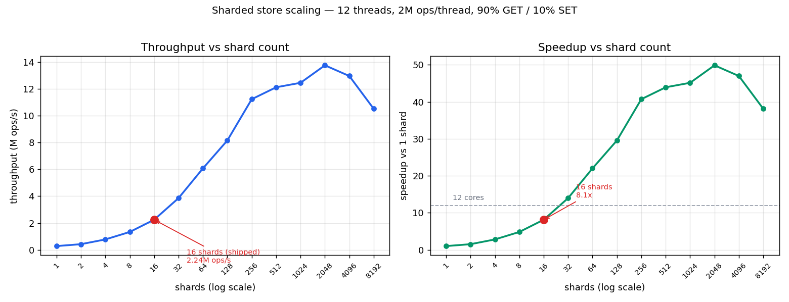

# Key Value In Memory Store

A small Redis-compatible in-memory key-value store in C++, written to study
concurrency and lock design under load. It speaks a subset of the RESP protocol
over TCP, so `redis-cli` and `redis-benchmark` work against it directly.

Supported commands: `GET`, `SET`, `DEL`, `PING`.

## Architecture

```
accept() loop  ->  thread pool  ->  per-connection worker  ->  RESP parser  ->  sharded store
```

The acceptor loop hands each connection to a thread pool (a `condition_variable`
task queue). A worker owns the connection for its lifetime, reading with blocking
`recv()` and looping parse → dispatch → reply until the client disconnects.

The store is sharded: a fixed `std::array<Shard, 16>`, each shard an
`unordered_map` behind its own `shared_mutex`. Keys route by
`hash(key) & (SHARD_COUNT - 1)`. Reads take a `shared_lock`, writes a
`unique_lock`, so reads to different shards — and concurrent reads to the same
shard — never block each other.

Source layout: `server.{h,cpp}` (server + thread pool), `resp.{h,cpp}` (RESP
parser), `store.{h,cpp}` (sharded store), `main.cpp`, `tests/`.

## Build and run

C++17 and CMake, developed on WSL2 / Ubuntu.

​```bash
cmake -B build && cmake --build build
./build/kv                  # listens on 6380
./build/tests               # integration test suite
​```

## Benchmarks

Two measurements: one locating the server's bottleneck end-to-end, and one
isolating and quantifying the sharded store's scaling on its own.

### Server, end-to-end

`redis-benchmark -t set,get -n 100000` against this server on 6380 and real Redis
on 6379, single global lock vs. 16 shards, connection count held constant.
Throughput is requests/sec; latency is p50 / p99 in milliseconds (GET and SET
were within ~3% of each other, so the higher of the two is shown).

| Configuration          | -c 50 (req/s) | p50 / p99 | -c 200 (req/s) | p50 / p99 |
|------------------------|--------------:|:---------:|---------------:|:---------:|
| Global lock            |        21,687 | 1.19 / 1.81 |        21,236 | 4.89 / 7.96 |
| 16 shards              |        22,124 | 1.17 / 1.74 |        22,017 | 4.73 / 7.21 |
| Real Redis (reference) |        53,419 | 0.47 / 1.02 |        49,801 | 2.05 / 5.62 |

These numbers locate the server's bottleneck precisely: it lives in the
connection model, not the lock. Each connection holds a thread in blocking
`recv()`, so throughput is governed by per-operation syscall cost and thread
scheduling — which is why p50 latency rises ~4x from 50 to 200 clients while
throughput stays flat: added clients queue behind threads, they don't add
parallel service capacity. The lock itself has headroom to spare, shown by GET
and SET running at the same rate (a contended lock would let concurrent
`shared_lock` readers outrun exclusive writers). The next lever for server
throughput is therefore an epoll event loop to multiplex many connections onto a
few threads. The store-level results below isolate and quantify the sharding win
on its own terms.

### Store, in isolation

To measure the shard change where it applies, `bench.cpp` drives the store
directly with no network: 12 threads (= core count), 2M ops each, 100k keys, 90%
GET / 10% SET, keys built before the timed region so the result reflects locking
rather than allocation.



| shards | throughput (ops/s) | speedup |
|-------:|-------------------:|--------:|
| 1      |            276,190 |   1.00x |
| 2      |            417,512 |   1.51x |
| 4      |            772,247 |   2.80x |
| 8      |          1,330,028 |   4.82x |
| 16     |          2,243,499 |   8.12x |
| 32     |          3,857,295 |  13.97x |
| 64     |          6,076,582 |  22.00x |
| 128    |          8,158,923 |  29.54x |
| 256    |         11,239,261 |  40.69x |
| 512    |         12,128,818 |  43.91x |
| 1024   |         12,463,552 |  45.13x |
| 2048   |         13,768,451 |  49.85x |
| 4096   |         12,971,427 |  46.97x |
| 8192   |         10,522,726 |  38.10x |

The speedup exceeds the 12-core count because sharding is recovering throughput
the single lock was holding back, not just spreading work across cores. With one
lock, writes serialize against all reads; splitting into independent shards lets
readers and writers on different keys proceed at once, so the gains compound well
past raw core parallelism. The curve climbs steeply through the low shard counts,
then plateaus around 12–14M ops/s once contention is gone and memory bandwidth
sets the pace. The full sweep maps the whole space, including where additional
shards stop paying off, so the production choice rests on measured data.

### Why 16 shards in production

Shard count should track concurrency, not chase the benchmark peak. Routing by
`hash & (N-1)` requires a power of two, leaving 8, 16, or 32 as realistic
choices: 8 sits below the core count and starves cores under load, 32 is already
past the point of useful concurrency. 16 is the smallest power of two above the
core count, and it captures 8.1x of the available gain while staying a
configuration a real system would actually run. The full sweep is kept here to
show that 16 is a deliberate point on a measured curve, not a guess.

## Scope

The feature set is scoped to keep the focus on lock design and measurement:

- **Synchronous I/O.** Thread-per-connection with blocking `recv()` keeps the
  networking model simple and correct; an epoll event loop is the clear next step
  for raising server throughput.
- **In-memory only.** Eviction, persistence, and replication are each their own
  subsystem and orthogonal to the concurrency work this project demonstrates.
- **Core command set** (`GET`, `SET`, `DEL`, `PING`) — enough to be
  RESP-compatible and to benchmark directly against real Redis.